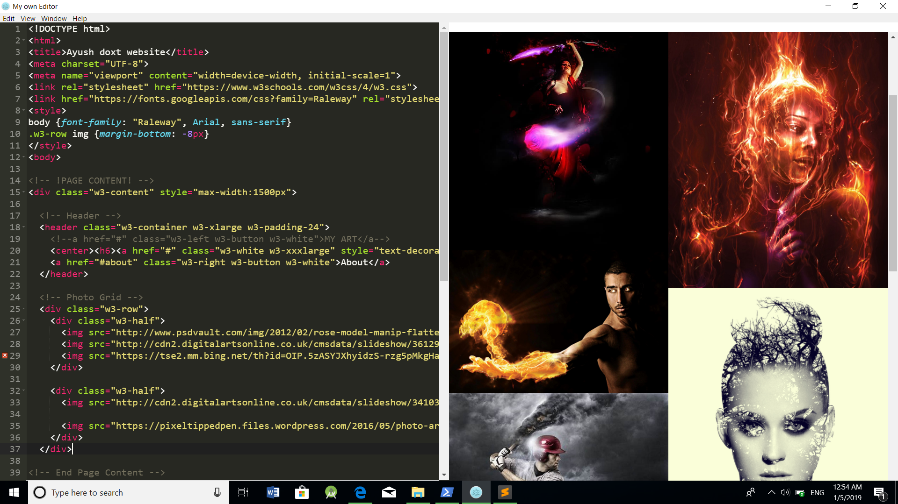

# FEstudio
This is a simple text editor with the ability of real time result generation. This tool(till now) consists features like html/js/css syntax highliting and real time output generation. This tool is made with Electron and is open source. It can be used in almost every OS that supports ElectronJs. 

# Screenshot

# Installation
You can download latest zipball by clicking the link below. 
https://github.com/FEStudio/FEstudio/archive/master.zip 
Or, you can download FEstudio by cloning the Git repository:  
git clone --depth 1 https://github.com/FEStudio/FEstudio.git  
FEstudio works best with Electron(v1.4.13) and Node(v11.3.0)

# How to use?
Head over to the folder where you have installed FEstudio.
Go inside the <b> /data/acc/ </b> folder and click on <b>FEstudio.bat</b> if you are a Window user.  
Update for other OS is coming soon...

